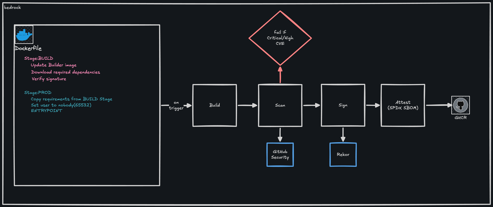

# bedrock

`bedrock` is a collection of hardened, reproducible container images and reusable CI workflows for building, scanning, signing, and attestation. `bedrock` makes it easy for downstream services to ship on a known secure foundation without re-inventing the supply-chain wheel.

## Overview

Every image in this repository goes through the same pipeline:



1. **Build** - [Buildx](https://github.com/docker/buildx) builds multi-architecture images (`linux/amd64`, `linux/arm64`) on a [distroless](https://github.com/GoogleContainerTools/distroless) base.
2. **Scan** - [Trivy](https://github.com/aquasecurity/trivy) performs a security scan. It gates on HIGH/CRITICAL CVEs and uploads a [SARIF](https://sarifweb.azurewebsites.net/) to GitHub code scanning
3. **Sign** - [Cosign](https://github.com/sigstore/cosign) keylessly signs images using the workflow's OIDC identity. The signatures are logged to [Rekor](https://docs.sigstore.dev/logging/overview/).
4. **Attest** - [Syft](https://github.com/anchore/syft) generates an SBOM which is subsequently attached to the image as a cosign attestation.

Images are published to GHCR at `ghcr.io/ej-east/<image-name>`. The build pipeline also exposes a reusable worfklow at `github/workflows/build-bedrock-image.yaml` that downstream repos call with `uses:`. 

## Quick Start 

### Pull and run

Pull `main` branch image:

```sh
docker run --rm -p 8080:8080 \
  -v "$PWD:/var/www:ro" \
  ghcr.io/ej-east/static-base:main
```

Pin to an immutable digest:

```sh
docker pull ghcr.io/ej-east/static-base@sha256:<digest>
```

### Use a baseline image 

Use the static webserver base image. This runs as nobody(UID 65532) and is distroless. 

```dockerfile
FROM ghcr.io/ej-east/static-base:latest
COPY ./site /var/www
```

### Use the baseline CI

You can add a thin caller in your repo called: `.github/workflows/build-<image-name>.yaml`

```yaml
name: build-<image-name>
on:
  push:
    branches: [main]
    paths:
      - "images/<image-name>/**"
      - ".github/workflows/build-<image-name>.yaml"
    tags:
      - "<image-name>/v*"
  pull_request:
    paths:
      - "images/<image-name>/**"
      - ".github/workflows/build-<image-name>.yaml"
  workflow_dispatch:

jobs:
  build:
    uses: ej-east/bedrock/.github/workflows/build-bedrock-image.yaml@main
    with:
      image-name: <image-name>
    permissions:
      contents: read
      packages: write
      id-token: write
      security-events: write
```

It's recommended to pin to a commit SHA to migitate possible supply chain attacks. 

### Verify a signed image

You need to install [cosign](https://github.com/sigstore/cosign)

```bash
cosign verify ghcr.io/ej-east/static-base:latest \
  --certificate-identity-regexp 'https://github.com/ej-east/bedrock/\.github/workflows/build-bedrock-image\.yaml@.*' \
  --certificate-oidc-issuer https://token.actions.githubusercontent.com
```

Verify/Download SBOM attestation:

```bash
cosign verify-attestation \
  --type spdxjson \
  --certificate-identity-regexp 'https://github.com/ej-east/bedrock/\.github/workflows/build-bedrock-image\.yaml@.*' \
  --certificate-oidc-issuer https://token.actions.githubusercontent.com \
  ghcr.io/ej-east/static-base:latest
```
## License

See [LICENSE.md](LICENSE.md).
